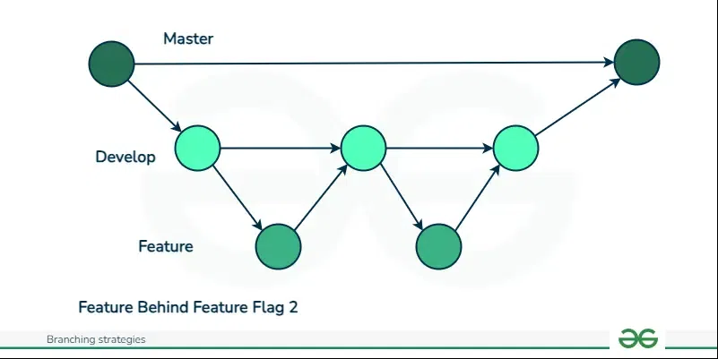

# Laravel Dieta Treino API

Uma API de dieta e treino que nada convencional. Nela você informar os alimentos que você não deseja comer, os seus treinos, peso e altura para a api ajudar no planejamento de suas metas.A proposta é bem simples, você informa todos os alimentos que você vai deixar de comer, a sua rotina de treino, seu peso, sua altura e o período que você pretende seguir este plano. Em seguida o sistema irá criar uma tabela contendo as datas, dieta, treino(s), peso e altura, onde os 4 últimos devem ser informados pelo usuário na referida data do plano da seguinte forma:
- Dieta: verdadeiro ou falso (cumpriu ou não cumpriu);
- Treino(s): verdadeiro ou falso (cumpriu ou não cumpriu);
- Peso (kg): Informar o peso em quilogramas;

# Documentação

- [Requisitos e regras de negócio](docs/requisitos-regras_de_negocio.md)
- [Iniciando o projeto (Legado)](docs/iniciando-o-projeto_legado.md)
- [Iniciando projeto com Docker](docs/iniciando-projeto-com-docker.md)
- [Features (documentação)]()
- [Diagramas e Fluxogramas](docs/diagramas)

# Workflow, Sprint, Features e Commits

O fluxo de desenvolvimento deste projeto foi inspirado no Gitlab workflow, porém este modelo não foi aplicado "à risca" neste projeto, apenas alguns conceitos foram levados em consideração.

Aqui temos uma branch main (master) que será da origem e deve ser "alimentada" por branches de dev (develop), que representa uma sprint de desenvolvimento. Cada sprint, ou branch dev, é responsável por desenvolver uma partição ou módulo do sistema. A branch dev pode possuir uma ou mais branches features, que serão responsáveis por desenvolver uma partição de cada módulo, ou de cada branch dev ou sprint.

Cada branch dev será composta pelo prefixo ``sprint `` seguido da versão do projeto, exemplo ``sprint v0.1``. As branches dev são lineares e dependentes, ou seja, a próxima dev depende do desenvolvimento da dev atual.

O pull request da dev para a branch main pode receber, como prefixo, o nome da branch dev + alguma descrição importante, exemplo ``sprint v0.1: Cadastro e Autenticação do Usuário``

As features e os commits devem possuir o prefixo de uma das seguintes categorias:
- ``feat:``: Desenvolvimento de uma feature;
- ``test:``: Teste da aplicação;
- ``docs:``: Documentação;
- ``chore:``: Adição de biblioteca ou desenvolvimento de um núcleo da aplicação;
- ``fix:`` Correção de algum bug;

Exemplo de nomenclatura de uma feature ou commit: ``chore: Inicio do projeto``.

# Rotas

Aqui temos um breve resumo de todas as rotas desta API. Vale lembrar que esta API utiliza o **Swagger** para documentar as suas rotas.

### Não Autenticadas
| Rota | Método | Descrição |
| ---- | ------ | --------- |
| ``api/docs`` | **GET** | Acesso a documentação completa das rotas da api |
| ``api/user`` | **POST** | Cadastrar usuário |
| ``api/auth`` | **POST** | Autenticação/Login do usuário |
| ``user/confirm/{hash}`` | **GET** | Confirmar o cadastro do usuário |

### Autenticadas
| Rota | Método | Descrição |
| ---- | ------ | --------- |
| ``api/user`` | **DELETE** | Excluir usuário do sistema (Schedule) |
| ``api/user`` | **PUT** | Atualizar conta do usuário |
| ``api/plan`` | **POST** | Cadastrar plano alimentar |
| ``api/plan/{id}`` | **PATCH** | Concluir plano alimentar |
| ``api/plan/{id}`` | **DELETE** | Excluir plano alimentar |
| ``api/plan/{id}`` | **GET** | Capturar plano alimentar |
| ``api/plan/{id}`` | **UPDATE** | Atualizar plano alimentar |
| ``api/plan/page/{?page_number}`` | **GET** | Capturar os planos alimentares por pagina (ordem decrecente)|
| ``api/food/{plan_id}`` | **GET** | Capturar a composição nutricional dos alimentos presente no plano de dieta e treino |

# Jobs e Schedule

### Job

| Nome | Rota (Disparo) | Delay | Descrição |
| ---- | -------------- | ------| --------- |
| **ConfirmarEmailJob** | **[POST]** ``api/user`` | **NONE** | Envia um email de confirmação de cadastro para a conta de email do usuário criado |
| **CalculoComposicaoAlimentosPlanoJob** | **[POST]** ``api/plan`` | **30s** | Calcula a composição nutricional dos alimentos presentes no plano de dieta e treino |

### Schedule

| Nome | Periodo | Descrição |
| ---- | ------- | --------- |
| **ExclusaoPendenteUsuarioJob** | Todos os dias as **01:00** | Exclui todos os usuários pendentes |
